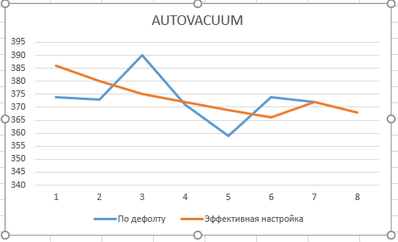

создать GCE инстанс типа e2-medium и диском 10GB

- Вместо GCE была создана виртуальная машина в VMware 

установить на него PostgreSQL 14 с дефолтными настройками

- Была ранее установлена

применить параметры настройки PostgreSQL из прикрепленного к материалам занятия файла

- Прошло без ошибок

выполнить pgbench -i postgres
запустить pgbench -c8 -P 60 -T 600 -U postgres postgres
дать отработать до конца
дальше настроить autovacuum максимально эффективно

- Настроила такие параметры как:
autovacuum_vacuum_scale_factor = 0.1 
autovacuum_analyze_scale_factor = 0.5
autovacuum_vacuum_cost_limit = 2000

построить график по получившимся значениям
так чтобы получить максимально ровное значение tps

- 